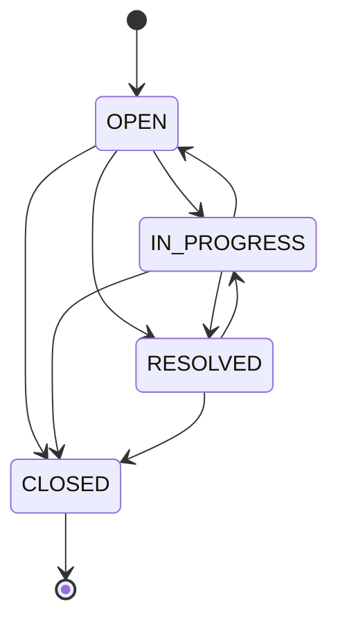
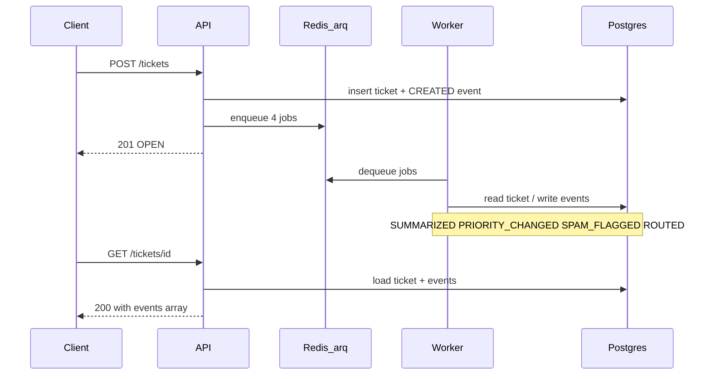

# Support Ticket Management System

A backend service for managing customer support tickets with asynchronous
processing. Built with FastAPI, PostgreSQL, and SQLAlchemy (async).

> **Status:** complete. Ticket CRUD API, async background worker (summary,
> priority, spam detection, department routing), structured JSON logging,
> Prometheus metrics, liveness/readiness probes — all running in a single
> `make run`. Worker results are visible in `GET /tickets/{id}` under `events`.

## Contents

- [Overview](#overview)
- [Architecture Decisions](#architecture-decisions)
- [Tech Stack](#tech-stack)
- [Setup](#setup)
  - [Local development (without containers)](#local-development-without-containers)
- [Environment Variables](#environment-variables)
- [API Documentation](#api-documentation)
- [API Usage](#api-usage)
  - [Grader quick path](#grader-quick-path)
  - [Status lifecycle](#status-lifecycle)
  - [Errors](#errors)
  - [Background processing](#background-processing)
  - [Transformer summarizer (optional)](#transformer-summarizer-optional)
  - [ML classifiers (optional)](#ml-classifiers-optional)
  - [Running ML backends in Compose](#running-ml-backends-in-compose)
  - [Seeing the ML backends in action](#seeing-the-ml-backends-in-action)
- [Observability](#observability)
  - [Structured JSON logs](#structured-json-logs)
  - [Correlation IDs](#correlation-ids)
  - [Prometheus metrics](#prometheus-metrics)
  - [Debugging a failed summarization (example flow)](#debugging-a-failed-summarization-example-flow)
  - [Health endpoints](#health-endpoints)
- [Testing](#testing)
- [Connection pool](#connection-pool)
- [Common Commands](#common-commands)
  - [Seed data](#seed-data)
- [Tradeoffs and Assumptions](#tradeoffs-and-assumptions)
- [Roadmap](#roadmap)
- [License](#license)

## Overview

The system lets customers create support tickets, agents update ticket status,
and background workers process tickets asynchronously (summary generation,
priority assignment, routing). It is structured in clean layers:

```text
API (routes)  ->  Service (business logic)  ->  Repository (data access)  ->  ORM
```

## Architecture Decisions

- **FastAPI** — native async, automatic OpenAPI docs, Pydantic validation.
- **asyncpg + SQLAlchemy 2.0 (async)** — true async database access with
  connection pooling.
- **Alembic** — version-controlled schema migrations.
- **Layered design** — routes, services, and repositories are separated so each
  layer is testable in isolation.
- **Enums for domain constants** — ticket status, priority, and category are
  enforced at both the schema and database level.

## Tech Stack

- Python 3.12+
- FastAPI
- PostgreSQL 16
- SQLAlchemy 2.0 (async) + asyncpg
- Alembic
- Docker / Podman + Compose

## Setup

Requires Docker (or Podman) and Compose. No local Python install needed to run
the containerized stack.

```bash
cp .env.example .env     # adjust if needed
make run                 # build and start all services (migrations run automatically)
make health              # verify the API is up
make demo-api            # API + worker walkthrough (recommended for review)
make seed                # optional: sample agents and tickets for manual exploration
```

The API is served at `http://localhost:8000`. The root path redirects to the
interactive docs.

`make demo-api` exercises the worker with the default keyword/rules backends. To
see the **optional ML backends** (transformer summarizer + zero-shot
priority/spam/routing) produce output, see
[Seeing the ML backends in action](#seeing-the-ml-backends-in-action).

### Local development (without containers)

```bash
make install-dev         # create .venv and install deps
make test-db             # start PostgreSQL in a container
make local-run           # run uvicorn with autoreload
```

To run the worker locally with DistilBART summarization:

```bash
make install-ml          # adds torch + transformers (see requirements-ml.txt)
SUMMARIZER_BACKEND=transformer python -m arq app.worker.main.WorkerSettings
```

## Environment Variables

| Variable                   | Description                                                | Default (Compose)                                                        |
| -------------------------- | ---------------------------------------------------------- | ------------------------------------------------------------------------ |
| `DATABASE_URL`             | Async SQLAlchemy connection URL (`+asyncpg`)               | `postgresql+asyncpg://ticketsupport:ticketsupport@db:5432/ticketsupport` |
| `REDIS_URL`                | Redis URL for the worker queue                             | `redis://redis:6379`                                                     |
| `SUMMARIZER_BACKEND`       | Worker summarizer: `noop`, `transformer`, or `anthropic`   | `noop` (worker service only)                                             |
| `ANTHROPIC_API_KEY`        | API key required by `SUMMARIZER_BACKEND=anthropic`         | (unset)                                                                  |
| `CLASSIFIER_BACKEND`       | Worker priority/spam/routing: `rules` or `zeroshot`        | `rules` (worker service only)                                            |
| `CLASSIFIER_MODEL`         | Zero-shot MNLI model (when `CLASSIFIER_BACKEND=zeroshot`)   | `valhalla/distilbart-mnli-12-3`                                          |
| `LOG_LEVEL`                | Log verbosity: `DEBUG` `INFO` `WARNING` `ERROR` `CRITICAL` | `INFO`                                                                   |
| `DEBUG`                    | Enable debug behavior                                      | `false`                                                                  |
| `DB_POOL_SIZE`             | SQLAlchemy connection pool size per process                | `20`                                                                     |
| `DB_MAX_OVERFLOW`          | Max connections above pool size per process                | `10`                                                                     |
| `RATE_LIMIT_CREATE_TICKET` | Per-IP rate limit for `POST /tickets` (slowapi format)     | `20/minute`                                                              |
| `WORKER_METRICS_PORT`      | Port for the worker's Prometheus `/metrics` endpoint       | `9091`                                                                   |

## API Documentation

Once running, interactive docs are available at:

- Swagger UI: `http://localhost:8000/docs`
- ReDoc: `http://localhost:8000/redoc`
- OpenAPI schema: `http://localhost:8000/openapi.json`

## API Usage

Enum values (`status`, `priority`, `category`) are accepted case-insensitively
and echoed back in canonical upper case.

### Grader quick path

[`scripts/demo-api.sh`](scripts/demo-api.sh) is the source of truth for an
end-to-end API walkthrough: ticket CRUD and status lifecycle, error envelopes,
OpenAPI surface, and live async worker results. It creates tickets via `POST`
(no hardcoded ids), seeds **agents only** when a compose `api` container is
available, and exits non-zero on the first failure.

Diagrams below summarize architecture; behavioral proof is still
`make demo-api`.

```bash
make run          # API + Postgres + Redis + worker (required for full demo)
make demo-api     # agents-only seed + demo phases A–C
```

- `make seed` — exploratory sample tickets with **static** audit events written
  at seed time (no queue). Useful for browsing the DB, not for proving workers.
- `make demo-api` — proves the **live API + queue**: worker events appear only on
  tickets created during the script’s Phase C `POST`.

Set `DEMO_WORKER=0` to run API-only checks (skips Phase C). With the default
`DEMO_WORKER=auto`, Phase C **fails** if Redis is not healthy — run the full
stack with `make run`. Use `VERBOSE=1` to print JSON bodies. See
`./scripts/demo-api.sh --help`.

If compose seed still prints `skip ticket ...`, the API container may be on an
old image — rebuild with `podman compose up -d --build --force-recreate api`
(or `docker compose` equivalent) so `--agents-only` is honored.

| Requirement                  | Demo phase                  | What you should see                                                                                   |
| ---------------------------- | --------------------------- | ----------------------------------------------------------------------------------------------------- |
| Create ticket (all fields)   | A — `[demo: create]`        | `201`, `status: OPEN`                                                                                 |
| Retrieve by id               | A — `[demo: retrieve]`      | `events` with `CREATED` only (no worker types yet)                                                    |
| List + filters + pagination  | A — `[demo: list]`          | `{ items, total, skip, limit }`                                                                       |
| Update status (agent)        | A — `[demo: update status]` | `OPEN → IN_PROGRESS → RESOLVED → CLOSED`, `409` from `CLOSED`                                         |
| OpenAPI surface              | B — OpenAPI smoke           | `openapi.json` lists POST/GET/PATCH ticket routes                                                     |
| REST validation + errors     | B — error envelopes         | `404` / `409` / `422` envelopes                                                                       |
| Async queue + stored results | C                           | Fresh ticket id with `SUMMARIZED`, `PRIORITY_CHANGED`, `SPAM_FLAGGED`, `ROUTED`; `priority: CRITICAL` |
| Assign agent (optional)      | A — `[extra: assign]`       | `ASSIGNED` event (demo extra; needs a seeded agent)                                                   |

### Status lifecycle

Allowed moves (simplified; source of truth:
[`app/services/ticket.py`](app/services/ticket.py) `ALLOWED_TRANSITIONS`).
Same-status `PATCH` is an idempotent no-op (no event). `CLOSED` is terminal.



The curls below mirror what the script exercises (replace `{id}` with a real
ticket id from `POST /tickets`):

```bash
# Create a ticket (201). Priority defaults to MEDIUM; category is case-insensitive.
curl -s -X POST http://localhost:8000/tickets \
  -H 'Content-Type: application/json' \
  -d '{
        "customer_name": "Ada Lovelace",
        "customer_email": "ada@example.com",
        "subject": "Cannot reset my password",
        "description": "The reset link 404s after I click it.",
        "category": "technical"
      }'

# Retrieve one ticket with event history (200, or 404 if missing)
curl -s http://localhost:8000/tickets/{id}

# List with filters + pagination (200). Returns {items, total, skip, limit}.
curl -s 'http://localhost:8000/tickets?status=OPEN&priority=MEDIUM&category=TECHNICAL&skip=0&limit=20'

# Full-text search across subject + description (200). Combines with filters.
curl -s 'http://localhost:8000/tickets?q=password+reset'
curl -s 'http://localhost:8000/tickets?q="two factor"&status=OPEN'

# Transition status (200). Illegal moves return 409; CLOSED is terminal.
curl -s -X PATCH http://localhost:8000/tickets/{id}/status \
  -H 'Content-Type: application/json' \
  -d '{"status": "in_progress"}'

# Assign to an agent (200). `make demo-api` seeds agents; or `make seed`.
curl -s -X PATCH http://localhost:8000/tickets/{id}/assign \
  -H 'Content-Type: application/json' \
  -d '{"agent_id": 1}'
```

### Errors

Every error returns a uniform envelope, `{"detail": ..., "error_type": ...}`
(request-validation failures add an `errors` list with per-field detail):

| `error_type`                | HTTP | When                                              |
| --------------------------- | ---- | ------------------------------------------------- |
| `validation_error`          | 422  | Request body/params failed validation             |
| `ticket_not_found`          | 404  | No ticket with that id                            |
| `agent_not_found`           | 404  | No support agent with that id                     |
| `invalid_status_transition` | 409  | Status move not allowed (e.g. out of `CLOSED`)    |
| `concurrent_update`         | 409  | Another request modified the ticket first (retry) |
| `internal_server_error`     | 500  | Unexpected server failure (details not exposed)   |

### Background processing

When Redis and the worker are running, creating a ticket enqueues four
background jobs that run asynchronously:

- One job per ticket per task, deduped by ticket id at enqueue time
- Ticket creation succeeds even if Redis is down or enqueue fails
- Each job runs at most once (`max_tries=1`); failures are logged, not retried



Simplified flow; enqueue details live in
[`app/services/ticket.py`](app/services/ticket.py) and
[`app/worker/tasks.py`](app/worker/tasks.py).

Worker results are written to `ticket_events` and returned in
`GET /tickets/{id}` under the `events` array (at most 100 events; when
truncated, `events_truncated` is true and `events_total` is the full count).

**Worker-emitted event types:**

| `event_type`       | `field_changed` | `new_value`                                                                         |
| ------------------ | --------------- | ----------------------------------------------------------------------------------- |
| `SUMMARIZED`       | `summary`       | Generated summary text (or original description with `noop` backend)                |
| `PRIORITY_CHANGED` | `priority`      | Upgraded priority (e.g. `"CRITICAL"`) — only if keywords detected; never downgrades |
| `SPAM_FLAGGED`     | `spam`          | `"true"` — ticket flagged for human review                                          |
| `ROUTED`           | `department`    | Routing department (e.g. `"technical-support"`, `"billing"`, `"general"`)           |

**Demo — async loop end-to-end:** `make demo-api` (Phase C) polls until the
worker ticket shows `CREATED`, `SUMMARIZED` (non-empty `summary`), `PRIORITY_CHANGED`,
`SPAM_FLAGGED` (`new_value: true`), `ROUTED` (`technical-support` for `TECHNICAL`),
and `priority: CRITICAL`.

> **Note:** `POST /tickets` and `GET /tickets` (list) return a flat ticket object
> (no `events`). `GET /tickets/{id}` and `PATCH .../status` or `.../assign` return
> the same detail shape with bounded `events` (see `events_truncated` when older
> rows are omitted).

**Summarizer backend:**

- With `SUMMARIZER_BACKEND=noop` (compose default): stored summary equals the
  ticket description unchanged
- With `SUMMARIZER_BACKEND=transformer`: uses `sshleifer/distilbart-cnn-6-6`
- Duplicate `SUMMARIZED` events are allowed (e.g. manual re-enqueue)

There is no re-summarize endpoint; a failed or skipped job is not backfilled
unless you add that explicitly later.

### Transformer summarizer (optional)

The default stack uses `noop` so containers start without ML dependencies.
To enable DistilBART (`sshleifer/distilbart-cnn-6-6`):

1. Install optional deps: `make install-ml` or `pip install -r requirements-ml.txt`
2. Set `SUMMARIZER_BACKEND=transformer` for the worker process
3. On first run, HuggingFace downloads ~300 MB of weights to the local cache

The worker defaults to `max_jobs=10`, but the HuggingFace pipeline object is
**not thread-safe**. `TransformerSummarizer` serializes inference with a
process-wide lock so concurrent arq jobs do not corrupt shared model state.
If you need higher throughput, run multiple worker replicas (each with its own
process and model copy) rather than raising `max_jobs` alone.

The lean default `Containerfile` runtime image does not include
`requirements-ml.txt`. To run transformer mode in Compose without a manual
Dockerfile edit, use the `runtime-ml` image stage and the `compose.ml.yaml`
overlay — see [Running ML backends in Compose](#running-ml-backends-in-compose).

#### Anthropic summarizer

A third backend summarizes via the Anthropic Messages API (Claude Haiku) instead
of a local model — useful when you want higher-quality summaries without shipping
torch/transformers. It needs no GPU and only a small dependency:

1. Install the optional dep: `pip install -r requirements-optional.txt`
2. Set `SUMMARIZER_BACKEND=anthropic` and `ANTHROPIC_API_KEY=sk-...` for the
   worker process:

   ```bash
   SUMMARIZER_BACKEND=anthropic ANTHROPIC_API_KEY=sk-... \
     python -m arq app.worker.main.WorkerSettings
   ```

The synchronous SDK call runs in `run_in_executor` so it never blocks the arq
event loop (same pattern as the transformer backend). If `ANTHROPIC_API_KEY` is
unset or the `anthropic` package is missing, the registry logs a warning and
falls back to `NoopSummarizer` — the worker keeps running. `anthropic` is not in
the default `requirements.txt` or the `Containerfile`, so the default stack
installs nothing new.

### ML classifiers (optional)

The priority, spam, and routing tasks ship with deterministic keyword/rule
classifiers (`CLASSIFIER_BACKEND=rules`, the default — no ML dependencies). An
optional zero-shot backend swaps in a transformer behind the same task
interface, the same way `SUMMARIZER_BACKEND` swaps DistilBART for `noop`:

1. Install optional deps: `make install-ml`
2. Set `CLASSIFIER_BACKEND=zeroshot` for the worker process
3. On first run, HuggingFace downloads the MNLI model (~700 MB,
   `valhalla/distilbart-mnli-12-3`; override with `CLASSIFIER_MODEL`, e.g.
   `facebook/bart-large-mnli` for higher accuracy at ~1.6 GB)

Concrete local worker command (combine with the transformer summarizer if you
want both ML backends in one process):

```bash
CLASSIFIER_BACKEND=zeroshot SUMMARIZER_BACKEND=transformer \
  python -m arq app.worker.main.WorkerSettings
```

Zero-shot classification needs no labeled training data: it scores the ticket
text against candidate labels via natural-language inference, then maps the top
label back to a `Priority` / spam flag / department. One shared pipeline serves
all three tasks (loaded once), with inference serialized under a process-wide
lock like the summarizer. If the ML dependencies are missing or the model fails
to load, the worker logs a warning and **falls through to the rules backend** —
the queue keeps working.

Two guards keep the ML output honest: spam uses single-label (softmax) scoring
so a long but legitimate ticket is not flagged in isolation, and routing defers
to the deterministic category→department map whenever the top zero-shot score is
below a confidence floor — ML only overrides the category rule when it is sure.

**Honest tradeoff:** for these tasks the keyword rules are deterministic,
instant, and dependency-free, and priority's upgrade-only semantics make a
confident keyword match safer than a fuzzy score. The zero-shot path mainly
demonstrates that the pluggable-backend pattern extends cleanly to ML; without a
labeled evaluation set it is not a proven accuracy win, which is why `rules`
stays the default.

### Running ML backends in Compose

The default stack (`make run`) stays lean: the worker runs the `noop` summarizer
and `rules` classifiers, with no ML dependencies in the image. To run the worker
with ML backends instead, use the dedicated image stage and Compose overlay:

```bash
make run-ml
# equivalent to:
podman compose -f compose.yaml -f compose.ml.yaml up --build -d
```

What this changes (only the worker; the API stays on the lean image):

- **Builds the `runtime-ml` image stage** — the multi-stage `Containerfile`
  layers `requirements-ml.txt` (torch + transformers) into a separate
  `builder-ml`/`runtime-ml` path, so the default `runtime` image is untouched.
- **Sets `SUMMARIZER_BACKEND=transformer` and `CLASSIFIER_BACKEND=zeroshot`** for
  the worker via `compose.ml.yaml`.
- **Mounts a named `hf_cache` volume** at `HF_HOME` (`/opt/hf-cache`) so the
  ~1 GB of HuggingFace weights download **once** on first worker startup, not on
  every restart.

First run is slow: the image build pulls ~2.5 GB of torch/transformers and the
worker then downloads ~1 GB of model weights into `hf_cache` — budget several
minutes, and watch `make worker-logs` for `model loaded` / `worker: ready`
before testing (it isn't hung). If the build or model load fails, the worker
logs a warning and falls back to the rules/noop backends — the queue keeps
working.
Tear down with `make container-down` (add `clear-db` semantics, or
`podman compose -f compose.yaml -f compose.ml.yaml down -v`, to also drop the
`hf_cache` volume).

### Seeing the ML backends in action

Two ways to actually watch the ML produce output:

**1. Fastest — printouts, no stack.** `make test-ml` installs the ML deps, then
runs two demo scripts before the test suite:

- [`scripts/demo_ml_summary.py`](scripts/demo_ml_summary.py) — prints a real
  DistilBART summary of a sample ticket (and how much shorter it is).
- [`scripts/demo_ml_classify.py`](scripts/demo_ml_classify.py) — prints the
  zero-shot **priority / spam / department** decision (with the winning label and
  confidence) for several sample tickets, including where the routing confidence
  floor defers to the category rule.

Either script also runs standalone once the ML deps are installed (`make
install-ml`), e.g. `python -m scripts.demo_ml_classify`. Example classifier
output:

```text
=== Technical outage (shared sample) ===
  Priority   : CRITICAL  (label 'critical incident or service outage', score 0.34)
  Spam       : NO        (spam score 0.43, threshold 0.50)
  Department : technical-support (zero-shot 'general inquiry or something else' 0.42, below 0.50 floor → category rule)
=== Promotional spam ===
  Priority   : HIGH      (label 'high priority or urgent issue', score 0.55)
  Spam       : YES       (spam score 1.00, threshold 0.50)
  Department : general   (zero-shot 'general inquiry or something else' 0.40, below 0.50 floor → category rule)
=== Billing refund ===
  Priority   : LOW       (label 'routine or low priority request', score 0.67)
  Spam       : NO        (spam score 0.17, threshold 0.50)
  Department : billing   (zero-shot 'billing, payment, refund, or invoice' 0.82)
```

Note the two guards at work: the long legitimate technical ticket is **not**
spam-flagged, and its low-confidence routing falls back to the category rule
(`technical-support`). Scores shift slightly by model version; the decisions are
stable.

**2. Live — ML decisions on a real ticket.** Bring up the ML worker, wait for the
models to load, then create a ticket and read its events (the snippet uses `jq`):

```bash
make run-ml
make worker-logs        # wait for "ZeroShotPipeline: model loaded" / "worker: ready"

# Create a ticket (capture its id), then read it back to see the ML-derived events
tid=$(curl -s -X POST http://localhost:8000/tickets -H 'Content-Type: application/json' \
  -d '{"customer_name":"Ada","customer_email":"ada@example.com",
       "subject":"Production database is completely down",
       "description":"Our entire production system is offline. Customers get 500 errors on every request.",
       "category":"technical"}' | jq -r .id)

curl -s "http://localhost:8000/tickets/$tid" | jq '.priority, .events'
```

You should see a `SUMMARIZED` event with a generated (not verbatim) summary, a
`PRIORITY_CHANGED` upgrade, and a `ROUTED` department — all produced by the
zero-shot/transformer backends rather than the keyword rules. Example (trimmed)
response:

```json
{
  "priority": "CRITICAL",
  "events": [
    {"event_type": "CREATED",          "new_value": "OPEN"},
    {"event_type": "PRIORITY_CHANGED", "field_changed": "priority",  "new_value": "CRITICAL"},
    {"event_type": "ROUTED",           "field_changed": "department", "new_value": "technical-support"},
    {"event_type": "SUMMARIZED",       "field_changed": "summary",    "new_value": "Customers get 500 errors on every request. Our entire produ..."}
  ]
}
```

> **Note:** use plain `curl` here, **not** `make demo-api`. The demo script
> asserts the *rules* backend's deterministic outcomes (e.g. `priority: CRITICAL`,
> `SPAM_FLAGGED`), which the ML backends may classify differently — so `demo-api`
> can fail against the ML stack even though everything is working.

## Observability

### Structured JSON logs

All log output is emitted as newline-delimited JSON. Every line includes
`timestamp`, `level`, `logger`, `message`, and any structured fields from the
call site (e.g. `ticket_id`, `elapsed_seconds`). API request lines also carry
`request_id`, which matches the `X-Request-ID` response header — use it to
correlate all lines for a single request, including worker jobs enqueued by that
request.

```bash
# Tail JSON logs from the running stack
docker compose logs -f api
docker compose logs -f worker

# Set DEBUG for verbose output
LOG_LEVEL=DEBUG docker compose up
```

### Correlation IDs

Every API request gets an `X-Request-ID` header in the response. Pass the same
header on the request to inject your own trace ID (must be a valid UUID4):

```bash
curl -H "X-Request-ID: 550e8400-e29b-41d4-a716-446655440000" \
     http://localhost:8000/health
```

### Prometheus metrics

```bash
# Scrape all metrics
curl http://localhost:8000/metrics
```

HTTP metrics (`http_requests_total`, `http_request_duration_seconds`,
`http_requests_inprogress`) are collected automatically per route.

The default `prometheus_client` process/platform/GC collectors (`process_*`,
`python_info`, `python_gc_*`) are **unregistered** at startup (`app/main.py`), so
`GET /metrics` exposes only the HTTP and business metrics below — no CPU, memory,
open-FD, start-time, or interpreter internals. This keeps the endpoint safe to
serve on the public API port without leaking operational details.

Custom business counters:

| Metric                                | Labels                     | Description                         |
| ------------------------------------- | -------------------------- | ----------------------------------- |
| `tickets_created_total`               | —                          | Tickets created via `POST /tickets` |
| `ticket_status_transitions_total`     | `from_status`, `to_status` | Successful status transitions       |
| `ticket_summarization_outcomes_total` | `outcome`                  | Enqueue outcomes at create time     |

`outcome` label values: `enqueued`, `deduped`, `skipped_no_pool`, `enqueue_failed`.

#### Worker metrics (separate port)

The arq worker runs in its own process, so it exposes its own Prometheus endpoint
on a dedicated port (default `9091`, set via `WORKER_METRICS_PORT`) rather than
the API's `/metrics`. With the stack up, scrape it directly:

```bash
curl http://localhost:9091/metrics
```

| Metric                          | Labels            | Description                                          |
| ------------------------------- | ----------------- | ---------------------------------------------------- |
| `worker_jobs_total`             | `task`, `outcome` | Task executions by terminal outcome                  |
| `worker_job_duration_seconds`   | `task`            | Histogram of task wall-clock duration                |
| `worker_summarizer_backend_info`| `backend`         | Active summarizer backend in the worker process      |

`task` values: `summarize_ticket`, `assign_priority`, `detect_spam`,
`route_ticket`. `outcome` values: `completed`, `skipped`, `not_found`, `failed`.
These cover **task execution** in the worker, complementing the API-side
`ticket_summarization_outcomes_total`, which only tracks **enqueue** outcomes at
create time. A scraper points at both `:8000/metrics` (API) and `:9091/metrics`
(worker). The metrics server is best-effort — a bind failure is logged and the
worker keeps processing jobs.

### Debugging a failed summarization (example flow)

1. `docker compose logs -f worker | grep '"ticket_id": 42'`
   — find all worker log lines for ticket 42.
2. From the complete/error line, copy `"request_id": "abc-123"`.
3. `docker compose logs -f api | grep '"request_id": "abc-123"'`
   — find the `POST /tickets` that created it and its latency.
4. `curl http://localhost:8000/metrics | grep ticket_summarization_outcomes`
   — check outcome counters to see how many jobs are failing vs. succeeding.
5. `curl http://localhost:8000/ready`
   — if `"redis": "unavailable"`, the worker never received the job.

### Health endpoints

The API exposes two separate probes — a standard pattern for containerised services:

**`GET /health` — liveness probe**

Returns 200 unconditionally. No network calls, no dependency checks. The Docker
`HEALTHCHECK` in `Containerfile` targets this endpoint so a Redis or Postgres
blip never restarts the container.

```bash
curl http://localhost:8000/health
# {"status": "ok"}
make health   # same — targets liveness only
```

**`GET /ready` — readiness probe**

Probes both Postgres and Redis (each with a 2-second timeout). Returns 200 when
both are healthy; 503 when either is degraded. Use this for load-balancer health
checks so traffic is held back when a dependency is temporarily unreachable.

```bash
curl http://localhost:8000/ready
# {"status": "ok",      "database": "ok",         "redis": "ok"}
# {"status": "degraded","database": "unavailable", "redis": "ok"}
# {"status": "degraded","database": "ok",          "redis": "unavailable"}
```

## Testing

```bash
make test         # run the test suite in a container (falls back to local)
make coverage     # run tests with a coverage report
make test-ml      # print DistilBART summary + priority/spam/routing decisions, then run ML tests
```

Tests run against an isolated `ticketsupport_test` database.

## Connection pool

Each Python process (API **and** worker) creates its own SQLAlchemy pool
(`DB_POOL_SIZE=20`, `DB_MAX_OVERFLOW=10` by default → up to **30**
connections per process; tune via environment variables).
The default Compose stack runs **two** processes, so plan for roughly
**60** concurrent Postgres connections under burst load.

PostgreSQL's default `max_connections` is **100**, which leaves modest headroom
for admin sessions and migration tooling. Before scaling out — multiple uvicorn
workers, several worker replicas, or other services on the same database —
either lower per-process pool settings or raise `max_connections` in Postgres.

The worker holds at most `max_jobs=10` concurrent arq tasks; each
`summarize_ticket` job uses two short DB sessions (read ticket, then write
event), so jobs do not hold a connection open during CPU-bound summarization.

## Common Commands

```bash
make help         # list all available targets
make run          # build and start the stack
make demo-api     # runnable walkthrough (phases A–C; agents-only seed in compose)
make health       # curl the /health liveness probe
make migrate      # apply database migrations in the running container
make install-ml   # optional: torch + transformers for local worker ML runs
make seed         # sample agents + tickets for local testing (idempotent)
make clean        # remove caches and build artifacts
```

### Seed data

After the stack is up, run `make seed` to insert three support agents and five
sample tickets covering every status (`OPEN`, `IN_PROGRESS`, `RESOLVED`, `CLOSED`),
multiple categories, and representative audit events (including worker-style
`SUMMARIZED` / `ROUTED` / `SPAM_FLAGGED` rows on selected tickets). Re-running
seed skips rows that already exist (matched by agent email or ticket email+subject).

```bash
make seed
curl -s 'http://localhost:8000/tickets?limit=10' | jq '.total, .items[].subject'
curl -s http://localhost:8000/tickets/2 | jq '.status, .events'
```

## Tradeoffs and Assumptions

This is a take-home project scoped for a single technical grader running
the stack once. The decisions below trade production completeness for clarity and
a clean, runnable demonstration of the core patterns.

**Assumptions:**

- **Single instance, trusted network.** One API process and one worker in the
  default Compose stack. Callers are trusted; the only abuse control is per-IP
  rate limiting on `POST /tickets` (`RATE_LIMIT_CREATE_TICKET`).
- **Grader runs the code first.** `make run` + `make demo-api` is the source of
  truth; the README documents behaviour, the demo proves it.
- **Postgres `max_connections=100` is enough.** Two processes × 30 connections
  (pool + overflow) ≈ 60, leaving headroom (see [Connection pool](#connection-pool)).

**Tradeoffs:**

- **No authentication.** All endpoints are unauthenticated. In production, JWT
  bearer tokens (or API keys for service callers) verified via a FastAPI
  `Depends` guard, with the resolved identity recorded as `actor_id` on audit
  events. Deferred — see [Roadmap](#roadmap).
- **Worker classification defaults to keyword rules.** Priority upgrade, spam
  detection, and department routing run deterministic keyword/rule heuristics by
  default — fast and dependency-free. An optional zero-shot ML backend
  (`CLASSIFIER_BACKEND=zeroshot`) swaps in a transformer behind the same task
  interface (see [ML classifiers](#ml-classifiers-optional)). Rules stay the
  default because, without a labeled eval set, the ML path is not a proven
  accuracy win over the rules here.
- **`noop` summarizer by default.** Containers start without ML dependencies; the
  stored summary equals the description. The real DistilBART backend is opt-in
  (`SUMMARIZER_BACKEND=transformer`, `make install-ml`) to keep the image small
  and startup fast.
- **Best-effort jobs, no retries.** Jobs run at most once (`max_tries=1`);
  failures are logged, not retried, and there is no re-summarize/backfill path.
  Ticket creation succeeds even if Redis is down or enqueue fails.
- **Response-shape asymmetry.** `GET /tickets/{id}` (and `PATCH .../status`,
  `.../assign`) return the full detail shape with an `events` array; `POST` and
  the list endpoint return a flat ticket (no `events`) to keep the list lean and
  avoid an N+1 load. Call `GET /tickets/{id}` to see worker results.
- **Bounded, unpaginated events.** Detail responses cap at 100 events
  (`events_truncated` / `events_total` signal omissions). There is no dedicated
  events pagination endpoint — acceptable for the demo, a clear next step at scale.
- **Optimistic locking, no row locks.** Concurrent updates are detected via a
  version check (`409 concurrent_update`, retry) rather than pessimistic locking,
  favouring throughput for a low-contention workload.

**Explicitly out of scope:** authentication/authorization, multi-tenancy, SLA
enforcement, and an Anthropic summarizer backend.

## Roadmap

- [x] Project foundation: models, migrations, config, `/health`
- [x] Ticket CRUD API (create, retrieve, list with pagination/filtering)
- [x] Status transition validation (state machine + optimistic locking)
- [x] Background worker — summarize-at-create, best-effort once
      (arq + pluggable backends)
- [x] Structured JSON logging, Prometheus metrics, correlation IDs
- [x] Observability hardening: liveness/readiness split, UUID4 correlation
      IDs, probe timeouts
- [x] Additional worker tasks — priority upgrade, spam detection, department
      routing (keyword rules by default, optional zero-shot ML backend; all
      write audit events)
- [x] Worker results visible in `GET /tickets/{id}` under `events`
- [x] Assign-agent REST endpoint — `PATCH /tickets/{id}/assign` sets
      `assigned_agent_id`, validates agent exists (404 `agent_not_found`), writes
      `ASSIGNED` audit event; idempotent when already assigned to the same agent
- [ ] **Authentication — deferred.** All endpoints are unauthenticated in this
      take-home scope. In production: JWT bearer tokens issued at login,
      verified via a FastAPI `Depends` guard, with the resolved agent/user
      identity passed as `actor_id` on audit events. API key middleware is a
      simpler alternative for server-to-server callers.

## License

Released under the [MIT License](LICENSE).
